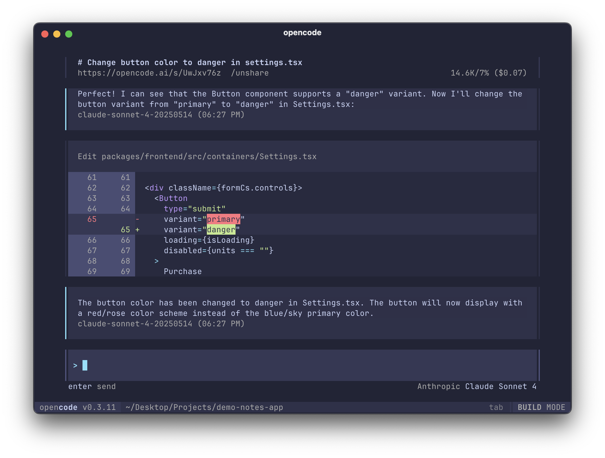

<pre align="center">
  _  __     _    __  __           _       
 | |/ /    | |  |  \/  |         | |      
 | ' / ___ | |  | \  / | __ _  __| |  ___ 
 |  < / _ \| |  | |\/| |/ _` |/ _` | / _ \
 | . \ (_) | |  | |  | | (_| | (_| ||  __/
 |_|\_\___/|_|  |_|  |_|\__,_|\__,_| \___|
</pre>
<p align="center"><strong>Klika Code</strong> — The open source AI coding agent for your terminal.</p>
<p align="center">
  <a href="https://github.com/klikaba/klikacode"></a>
  <a href="https://github.com/anomalyco/opencode/actions/workflows/publish.yml"></a>
</p>

[](https://github.com/klikaba/klikacode)

---

> [!NOTE]
> **Klika Code** is a customized fork of [OpenCode](https://github.com/anomalyco/opencode), tailored for Klika's development workflows. This fork focuses on the **terminal CLI** — desktop and web apps are maintained by upstream OpenCode.

### Installation

```bash
# YOLO install
curl -fsSL https://opencode.ai/install | bash

# Package managers
npm i -g opencode-ai@latest        # or bun/pnpm/yarn
scoop bucket add extras; scoop install extras/opencode  # Windows
choco install opencode             # Windows
brew install anomalyco/tap/opencode # macOS and Linux (recommended)
brew install opencode              # macOS and Linux
paru -S opencode-bin               # Arch Linux
mise use -g opencode               # Any OS
nix run nixpkgs#opencode           # or github:anomalyco/opencode
```

After installation, run the CLI with:

```bash
klika-code
```

> [!TIP]
> Remove versions older than 0.1.x before installing.

### Agents

Klika Code includes two built-in agents you can switch between with the `Tab` key.

- **build** - Default, full access agent for development work
- **plan** - Read-only agent for analysis and code exploration
  - Denies file edits by default
  - Asks permission before running bash commands
  - Ideal for exploring unfamiliar codebases or planning changes

Also, included is a **general** subagent for complex searches and multistep tasks.
This is used internally and can be invoked using `@general` in messages.

Learn more about [agents](https://opencode.ai/docs/agents).

### Documentation

For more info on how to configure Klika Code, see the [**official OpenCode documentation**](https://opencode.ai/docs).

### Contributing

If you're interested in contributing to Klika Code, please read our [contributing docs](./CONTRIBUTING.md) before submitting a pull request.

### Building on Klika Code

If you are working on a project that's related to Klika Code and is using "klikacode" or "klika-code" as a part of its name; for example, "klikacode-dashboard" or "klika-code-mobile", please add a note to your README to clarify that it is not built by the Klika Code team and is not affiliated with us in any way.

### FAQ

#### How is this different from Claude Code?

It's very similar to Claude Code in terms of capability. Here are the key differences:

- 100% open source
- Not coupled to any provider. Although we recommend the models we provide through [OpenCode Zen](https://opencode.ai/zen); OpenCode can be used with Claude, OpenAI, Google or even local models. As models evolve the gaps between them will close and pricing will drop so being provider-agnostic is important.
- Out of the box LSP support
- **A focus on TUI** — OpenCode is built by neovim users and the creators of [terminal.shop](https://terminal.shop); we push the limits of what's possible in the terminal.
- A client/server architecture. This for example can allow OpenCode to run on your computer, while you can drive it remotely from a mobile app. Meaning that the TUI frontend is just one of the possible clients.

#### How is Klika Code different from OpenCode?

Klika Code is a branded fork of OpenCode with:
- Klika-specific branding and agent identity
- Custom configurations for Klika's development environment
- Full compatibility with upstream OpenCode updates

We regularly sync with [upstream OpenCode](https://github.com/anomalyco/opencode) to stay current with new features and improvements.

---

**Join our community** [Discord](https://discord.gg/opencode) | [X.com](https://x.com/opencode)

**Klika Code** is maintained by [Klika](https://github.com/klikaba). For upstream issues, see [OpenCode](https://github.com/anomalyco/opencode).
